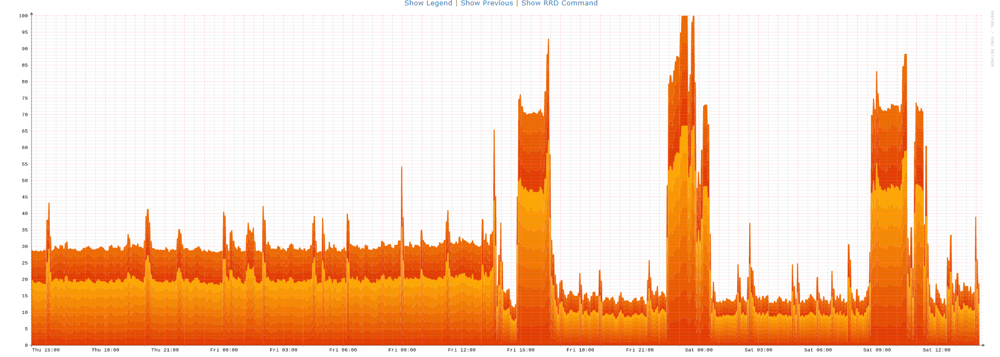

# Saving resources with CrowdSec

I am a hobbyist with a homelab - rocking on an old Xeon CPU with quite some RAM as a hypervisor. Proxmox running KVM. My machines range from mail- to webserver, gameserver, docker containers with various services running - you name it.

My motto for the homelab is pretty much 'can do' instead of thinking twice and I have to say, I was pretty at the limit of my capacity with my 10 virtual machines and I was used to the background noise caused by the attacks coming in and hitting my server as I had to expose some services to the outside to be able to use them on the go or to do federation in case of matrix. I guess you see the picture.

At some point - some month ago - I was introduced to CrowdSec and as I already used fail2ban I was curious and it couldn't do any worse than fail2ban, would it?

I started to implement the parser on my webserver where my "big" nginx server was humming and decided to do the bouncing via an IP list on my firewall as bots usually go for ranges and there's no point in letting them hammer other services.

As I was fidgeting with some other things and being noisy on the discord I completely forgot about my crowdsec installation and suddenly had a slight moment of panic as my load on my proxmox server significantly dropped.

In a rush I checked all the services I run to see which one died until I opened up my monitoring software that showed the same drop on nearly all machines having some ports exposed, did some updates (those are the spikes after the drop) and tried to find the reason for why the CPU usage was that seemingly "off" as if I would be lacking a whole virtual machine.

## What happened?

The story is pretty simple: Every request you send to a server consumes CPU cycles. Even "Access denied" is at least some requests served - not counting malicious scripts hammering your website search forcing the database to do some work.

By blocking the malicious hosts via fail2ban only, they could still annoy my other VMs or services as I was not able to sync those bans across all my hosts. Please don't take this for bashing fail2ban as we are comparing a brand new solution to something that started back in 2004...

We are so used to background noise in our logs and we just accept malicious actors burning resources on our servers, that we do not even recognize how much that 'little annoyance in the log files' actually costs us.

**Warning: May contain traces of alpacas, crowd and a lot of hidden potential you're not yet aware of.**

I am a hobbyist with a homelab - rocking on an old Xeon CPU with quite some RAM as a hypervisor. Proxmox running KVM. My machines range from mail- to webserver, gameserver, docker containers with various services running - you name it.

My motto for the homelab is pretty much 'can do' instead of thinking twice and I have to say, I was pretty at the limit of my capacity with my 10 virtual machines and I was used to the background noise caused by the attacks coming in and hitting my server as I had to expose some services to the outside to be able to use them on the go or to do federation in case of matrix. I guess you see the picture.

At some point - some month ago - I was introduced to CrowdSec and as I already used fail2ban I was curious and it couldn't do any worse than fail2ban, would it?

I started to implement the parser on my webserver where my "big" nginx server was humming and decided to do the bouncing via an IP list on my firewall as bots usually go for ranges and there's no point in letting them hammer other services.

As I was fidgeting with some other things and being noisy on the discord I completely forgot about my crowdsec installation and suddenly had a slight moment of panic as my load on my proxmox server significantly dropped.

In a rush I checked all the services I run to see which one died until I opened up my monitoring software that showed the same drop on nearly all machines having some ports exposed, did some updates (those are the spikes after the drop) and tried to find the reason for why the CPU usage was that seemingly "off" as if I would be lacking a whole virtual machine.

## What happened?

The story is pretty simple: Every request you send to a server consumes CPU cycles. Even "Access denied" is at least some requests served - not counting malicious scripts hammering your website search forcing the database to do some work.

By blocking the malicious hosts via fail2ban only, they could still annoy my other VMs or services as I was not able to sync those bans across all my hosts. Please don't take this for bashing fail2ban as we are comparing a brand new solution to something that started back in 2004...

We are so used to background noise in our logs and we just accept malicious actors burning resources on our servers, that we do not even recognize how much that 'little annoyance in the log files' actually costs us.

**Warning: May contain traces of alpacas, crowd and a lot of hidden potential you're not yet aware of.**
